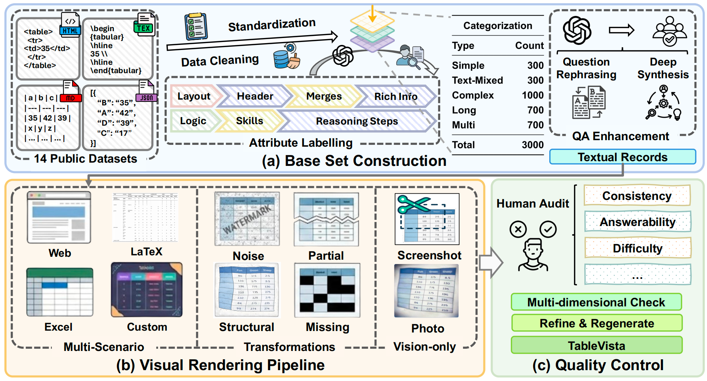

# TableVista

<p align="center">
    🤗 <a href="https://huggingface.co/datasets/TableVista/TableVista">Hugging Face</a>&nbsp&nbsp | &nbsp&nbsp📄 <a href="https://arxiv.org/abs/2605.05955">arXiv</a>
</p>

## 📖 Abstract

**TableVista** is a benchmark for evaluating multimodal table reasoning under visual and structural complexity. It contains **3,000 table reasoning problems**, each rendered into **10 visual variants**, resulting in **30,000 multimodal samples** across diverse styles, perturbations, and vision-only settings. We evaluate 29 open-source and proprietary foundation models and find that models are generally robust to rendering style changes, but degrade substantially on complex table structures and vision-only inputs. These results highlight key limitations in current multimodal models and provide insights for building more reliable table understanding models.

<div align="center">

<p><em>Overview of the TableVista.</em></p>
</div>

## 🚀 Quick Start

### Installation

```bash
git clone https://github.com/FlowRays/TableVista.git
cd TableVista

conda create -n tablevista python=3.11 -y
conda activate tablevista

pip install -r requirements.txt
playwright install chromium
```

### Dataset

Download the dataset from [Hugging Face](https://huggingface.co/datasets/TableVista/TableVista) and place it under `dataset/`.

```text
dataset/
├── data.jsonl
└── visual-set/
```

`dataset/data.jsonl` contains `id`, `text`, `question`, `answer`, `category`, `difficulty`, `table`, `table_missing`, and `visual`. The `visual` object stores paths to the rendered table variants under `dataset/visual-set/`.

## 🎨 Rendering

```bash
# Render all configured visual variants
python scripts/render.py --config configs/render.yaml

# Render a small subset
python scripts/render.py --config configs/render.yaml --output outputs/visual-set-test --limit 10 --overwrite

# Run sharded rendering
python scripts/render.py --config configs/render.yaml --output outputs/visual-set --num-shards 8
```

Rendering options are configured in `configs/render.yaml`.

## 📈 Evaluation

API evaluation uses the OpenAI Python SDK and supports OpenAI-compatible endpoints.

```bash
export OPENAI_API_KEY=...

python scripts/eval.py --config configs/eval.yaml --model gpt-5.4 --limit 20
```

For local vLLM evaluation:

```bash
export MODEL_ROOT=/path/to/hf_models

python scripts/eval.py --config configs/eval.yaml --model Qwen/Qwen2.5-VL-7B-Instruct
```

## 📝 Citation

If you find TableVista useful in your research, please cite our paper:

```bibtex
@misc{yang2026tablevistabenchmarkingmultimodaltable,
      title={TableVista: Benchmarking Multimodal Table Reasoning under Visual and Structural Complexity},
      author={Zheyuan Yang and Liqiang Shang and Junjie Chen and Xun Yang and Chenglong Xu and Bo Yuan and Chenyuan Jiao and Yaoru Sun and Yilun Zhao},
      year={2026},
      eprint={2605.05955},
      archivePrefix={arXiv},
      primaryClass={cs.CL},
      url={https://arxiv.org/abs/2605.05955},
}
```
